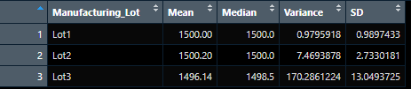
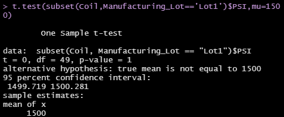
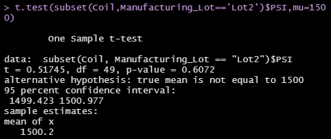
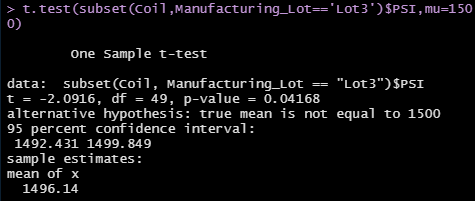

# MechaCar Statistical Analysis

## Project Overview
The Upper management of AutosRUs have asked the data analytics team to review the production data for insights on their newest prototype, the MechaCar. The prototype is suffering from production troubles which are blocking the manufacturing team's progress.
1. Perform linear regression on MechaCar_mpg data and determine the p-value and the r-squared value.
2. Read in the Suspension_Coil.csv as a table and create a total_summary dataframe using the summarize() function and then group each manufacturing lot by mean, median, variance, and standard deviation of the suspension coil's PSI column.
3. Determine the PSI across all manufacturing lots using a t-test, and then determine whether the PSI for each manufacturing lot is statistically different from the population mean.

## Resources
- Data Sources: MechaCar_mpg.csv, Suspension_Coil.csv
- Software: RStudio 2022.02.1 Build 461

## Summary
### Linear Regression to Predict MPG

- Based on the linear model, vehicle length and ground clearance provided a non-random amount of variance to the mpg values in the dataset.
- The p-value of 5.35e-11, which is lower than 0.05, shows that there is strong evidence against the null hypothesis of the slope being 0. This means we can accept the alternative hypothesis of the slope not being 0.
- The multiple r-squared value of 0.7149 shows that about 71.49% of the variance in the mpg predictions can be explained by the linear model. This shows that the model effectively predicts the mpg of MechaCar prototypes.

### Summary Statistics on Suspension Coils
The design specification for the suspension coils state that the variance must not exceed 100 pounds per square inch.

- Based on the table, we can see that the variance of the total summary falls within the necessary specification.

- We can verify that the variances for Lots 1 and 2 are within the specifications for the suspension coils; however, it seems that the variance for Lot 3 exceeds the limit of 100 pounds per square inch.

### T-Tests on Suspension Coils

- After performing a t-test on all the lots, we have a p-value of 0.06028. The p-value is highter than 0.05 so we fail to reject the null hypothesis and can state that there is no statistical difference between the sample and population means.

#### Lot 1 T-Test

- The results of performing a t-test on Lot 1 show that the p-value is 1, which is greater than 0.05. We then fail to reject the null hypothesis. There is no statistical difference between the sample and population means.

#### Lot 2 T-Test

- The results of performing a t-test on Lot 2 show that the p-value is 0.6072, which is greater than 0.05. We then fail to reject the null hypothesis. There is no statistical difference between the sample and population means.

#### Lot 3 T-Test

- The results of performing a t-test on Lot 3 show that the p-value is 0.04168, which is less than 0.05. We can reject the null hypothesis and accept the alternative hypothesis. There is a statistical difference between the sample and populations means.

### Study Design: MechaCar vs Competition
Gas prices these days have increased quite a bit more than people expected. It would help people's decision in choosing a MechaCar if the fuel efficiency were to be better than other cars, so we need to create a null and alternative hypothesis.

**H0 (Null Hypothesis)**: The MechaCar's fuel efficiency is not different from its competitors.

**HA (Alternative Hypothesis)**: The MechaCar's fuel efficiency is different from its competitors.

We would need to use a t-test between the MechaCar's fuel efficiency and the cumulative fuel efficiency of the competitors. We would then need to do multiple t-tests between the MechaCar and each car model. The data needed would be the fuel efficiency of the car models from the Fuel Economy government page.
