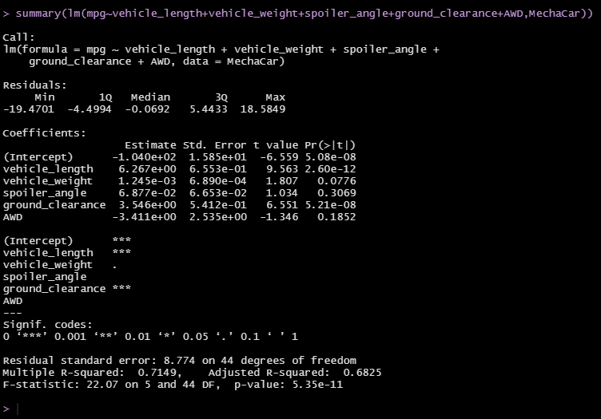

# MechaCar Statistical Analysis

## Project Overview
The Upper management of AutosRUs have asked the data analytics team to review the production data for insights on their newest prototype, the MechaCar. The prototype is suffering from production troubles which are blocking the manufacturing team's progress.
1. Perform linear regression on MechaCar_mpg data and determine the p-value and the r-squared value.
2. Read in the Suspension_Coil.csv as a table and create a total_summary dataframe using the summarize() function and then group each manufacturing lot by mean, median, variance, and standard deviation of the suspension coil's PSI column.
3. Determine the PSI across all manufacturing lots using a t-test, and then determine whether the PSI for each manufacturing lot is statistically different from the population mean.

## Resources
- Data Sources: MechaCar_mpg.csv, Suspension_Coil.csv
- Software: RStudio 2022.02.1 Build 461

## Summary
### Linear Regression to Predict MPG

- Based on the linear model, vehicle length and ground clearance provided a non-random amount of variance to the mpg values in the dataset.
- The p-value of 5.35e-11, which is lower than 0.05, shows that there is strong evidence against the null hypothesis of the slope being 0. This means we can accept the alternative hypothesis of the slope not being 0.
- The multiple r-squared value of 0.7149 shows that about 71.49% of the variance in the mpg predictions can be explained by the linear model. This shows that the model effectively predicts the mpg of MechaCar prototypes.
